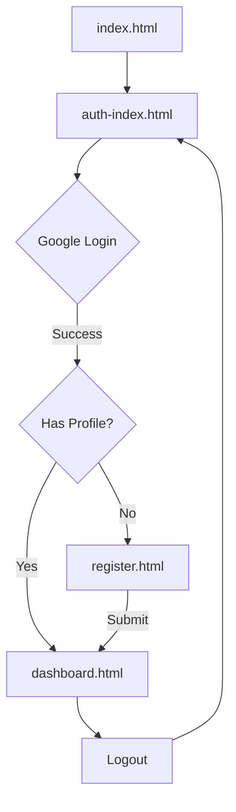

# NSA Network - Supabase Authentication Setup

A complete login + registration system using Supabase with plain HTML, CSS, and JavaScript.

## 🚀 Features

- **Google OAuth Login** - Seamless authentication with Google
- **Profile Registration** - Complete user profile form
- **Dashboard** - Personalized welcome and quick actions
- **Responsive Design** - Clean, modern UI that works on all devices
- **Real-time Auth** - Instant login state management

## 📁 File Structure

```
NSA-Website/
├── supabase.js          # Supabase client configuration
├── index.html           # Redirect page
├── auth-index.html      # Main login page with Google OAuth
├── register.html        # Profile registration form
├── dashboard.html       # User dashboard
└── SUPABASE_SETUP.md    # This file
```

## 🔧 Setup Instructions

### 1. Supabase Project Setup

1. **Create a new Supabase project** at [supabase.com](https://supabase.com)
2. **Get your project credentials**:
   - Go to Settings → API
   - Copy your `Project URL` and `anon public` key

### 2. Update Configuration

Edit `supabase.js` and replace the placeholder values:

```javascript
const SUPABASE_URL = 'https://your-project-id.supabase.co';
const SUPABASE_ANON_KEY = 'your-anon-public-key-here';
```

### 3. Database Schema

Run this SQL in your Supabase SQL Editor to create the profiles table:

```sql
-- Create profiles table
CREATE TABLE profiles (
    id UUID DEFAULT gen_random_uuid() PRIMARY KEY,
    user_id UUID REFERENCES auth.users(id) ON DELETE CASCADE UNIQUE NOT NULL,
    first_name TEXT NOT NULL,
    last_name TEXT NOT NULL,
    email TEXT NOT NULL,
    phone TEXT,
    university TEXT NOT NULL,
    major TEXT,
    graduation_year INTEGER,
    current_location TEXT,
    bio TEXT,
    created_at TIMESTAMP WITH TIME ZONE DEFAULT NOW(),
    updated_at TIMESTAMP WITH TIME ZONE DEFAULT NOW()
);

-- Enable Row Level Security (RLS)
ALTER TABLE profiles ENABLE ROW LEVEL SECURITY;

-- Create policies for profiles table
CREATE POLICY "Users can view their own profile" ON profiles
    FOR SELECT USING (auth.uid() = user_id);

CREATE POLICY "Users can insert their own profile" ON profiles
    FOR INSERT WITH CHECK (auth.uid() = user_id);

CREATE POLICY "Users can update their own profile" ON profiles
    FOR UPDATE USING (auth.uid() = user_id);

-- Create function to update updated_at timestamp
CREATE OR REPLACE FUNCTION update_updated_at_column()
RETURNS TRIGGER AS $$
BEGIN
    NEW.updated_at = NOW();
    RETURN NEW;
END;
$$ language 'plpgsql';

-- Create trigger to automatically update updated_at
CREATE TRIGGER update_profiles_updated_at 
    BEFORE UPDATE ON profiles 
    FOR EACH ROW 
    EXECUTE PROCEDURE update_updated_at_column();
```

### 4. Google OAuth Configuration

1. **Go to Supabase Dashboard** → Authentication → Providers
2. **Enable Google provider**
3. **Create Google OAuth App**:
   - Go to [Google Cloud Console](https://console.cloud.google.com)
   - Create a new project or select existing
   - Enable Google+ API
   - Go to Credentials → Create OAuth 2.0 Client ID
   - Set application type to "Web application"
   - Add authorized redirect URIs:
     ```
     https://your-project-id.supabase.co/auth/v1/callback
     ```
4. **Copy Client ID and Secret** to Supabase Google provider settings
5. **Set redirect URL** in Supabase to your domain (e.g., `https://yourdomain.com`)

### 5. Deploy and Test

1. **Upload files** to your web server
2. **Open** `index.html` in your browser
3. **Test the flow**:
   - Click "Continue with Google"
   - Complete registration form
   - View dashboard

## 🎯 User Flow



## 📊 Database Schema

### `profiles` Table

| Column | Type | Required | Description |
|--------|------|----------|-------------|
| `id` | UUID | ✅ | Primary key |
| `user_id` | UUID | ✅ | Foreign key to auth.users |
| `first_name` | TEXT | ✅ | User's first name |
| `last_name` | TEXT | ✅ | User's last name |
| `email` | TEXT | ✅ | User's email address |
| `phone` | TEXT | ❌ | Phone number |
| `university` | TEXT | ✅ | University name |
| `major` | TEXT | ❌ | Field of study |
| `graduation_year` | INTEGER | ❌ | Expected graduation year |
| `current_location` | TEXT | ❌ | Current city/state |
| `bio` | TEXT | ❌ | User biography |
| `created_at` | TIMESTAMP | ✅ | Account creation time |
| `updated_at` | TIMESTAMP | ✅ | Last update time |

## 🔐 Security Features

- **Row Level Security (RLS)** - Users can only access their own data
- **OAuth Authentication** - Secure Google sign-in
- **Input Validation** - Client and server-side validation
- **HTTPS Only** - All API calls use secure connections

## 🎨 UI Features

- **Responsive Design** - Works on desktop, tablet, and mobile
- **Loading States** - Visual feedback during operations
- **Error Handling** - User-friendly error messages
- **Success Notifications** - Confirmation messages
- **Clean Styling** - Modern, professional appearance

## 🚨 Important Notes

1. **HTTPS Required** - Google OAuth requires HTTPS in production
2. **Domain Configuration** - Update redirect URLs for your domain
3. **Environment Variables** - Keep your Supabase keys secure
4. **RLS Policies** - Ensure proper data access controls
5. **Error Handling** - Monitor console for debugging

## 📱 Browser Support

- Chrome 60+
- Firefox 55+
- Safari 12+
- Edge 79+

## 🔍 Troubleshooting

### Common Issues:

1. **"Invalid redirect URL"**
   - Check Google OAuth redirect URIs
   - Verify Supabase redirect URL settings

2. **"Profile not found"**
   - Ensure database schema is created
   - Check RLS policies

3. **"Login failed"**
   - Verify Supabase credentials in `supabase.js`
   - Check browser console for errors

4. **"CORS errors"**
   - Ensure HTTPS is used
   - Check domain configuration

## 📞 Support

For issues or questions:
1. Check browser console for errors
2. Verify Supabase dashboard for auth logs
3. Test with different browsers/devices
4. Review this setup guide step by step

---

**Built with ❤️ for the NSA Network community**
